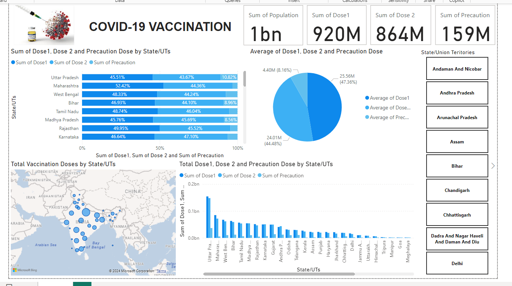

# COVID-19 Vaccination Data Analysis Dashboard

[COVID-19 Vaccination Dashboard Advanced](./Dashboard-image-2.png)

## Overview
This Power BI dashboard provides an in-depth analysis of COVID-19 vaccination data across Indian states and Union Territories. The visualization includes key metrics such as the total number of doses administered (Dose 1, Dose 2, and Precaution Dose), population coverage, and state-wise distribution. The dashboard is designed to offer insights into the progress of the vaccination campaign, helping stakeholders understand the effectiveness and reach of the program.

## Key Visualizations

### Total Vaccination Doses by State/UT
- **Bar Chart (Top Left):** Displays the percentage of population covered by Dose 1, Dose 2, and the Precaution Dose across various states. This helps in understanding the proportion of the population that has been vaccinated with each dose in each state.
- **Map Visualization (Bottom Left):** Provides a geographical representation of the total number of doses administered across India. Larger circles represent higher vaccination numbers, giving a quick visual reference of which states are leading in vaccination efforts.

### Sum of Dose 1, Dose 2, and Precaution Dose (Top Right)
- **KPI Cards:** These cards highlight the total number of each dose administered across the country. It shows:
  - Total population covered by Dose 1: 920M
  - Total population covered by Dose 2: 864M
  - Total population covered by Precaution Dose: 159M
- **Pie Chart:** Represents the average distribution of Dose 1, Dose 2, and Precaution Dose, showing the overall balance between the doses administered.

### State/UT Selection (Right Side)
- **Slicer:** Allows users to filter the data by selecting specific states or Union Territories. This interactivity helps in focusing the analysis on particular regions.

### Total Dose 1, Dose 2, and Precaution Dose by State/UT (Bottom Right)
- **Bar Chart:** This chart shows the cumulative sum of all doses administered by each state/UT, providing a comparative view of vaccination progress across regions.

## Key Findings
- Uttar Pradesh has the highest number of doses administered across all categories, indicating strong vaccination efforts in the state.
- Maharashtra and West Bengal also show significant progress in vaccinating their populations, with a high percentage of Dose 1 and Dose 2 coverage.
- Precaution Dose coverage is comparatively lower, suggesting a potential area for increased focus in future vaccination drives.
- The geographical visualization clearly highlights the disparity in vaccination coverage between various states, with some states like Tamil Nadu and Madhya Pradesh showing lower overall percentages.

## Project Goals
The primary goal of this project was to visualize and analyze the distribution and coverage of COVID-19 vaccinations across India. By leveraging Power BI’s interactive features, the dashboard provides insights into vaccination trends, helping policymakers and health organizations target areas with lower coverage for improved outreach.

## Technology Stack
- **Data Source:** [Specify the source of your data if available, e.g., Ministry of Health and Family Welfare, Government of India]
- **Tool:** Power BI Desktop
- **Visualizations:** Bar Chart, Map, Pie Chart, KPI Cards, Slicer

## How to Use
- **Filter by State/UT:** Use the slicer on the right to filter the data by specific states or Union Territories.
- **Hover Over Charts:** Hovering over charts will display tooltips with additional details about the data points.
- **Interact with Visuals:** Click on different parts of the visualizations to see how the data dynamically updates across the dashboard.

## Conclusion
This dashboard serves as a crucial tool for understanding the current state of COVID-19 vaccinations in India. By providing a clear visual representation of the data, it aids in identifying regions that require more attention and resources to improve vaccination coverage.
